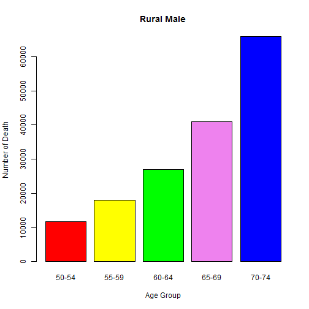

1) Developing Data Products - Week 4 Course Project
========================================================
author: eagle-eye33
date:   31 January 2016

2) Project Details
========================================================

A simple Shiny application has been developed to 
show a bar chart of Number of Deaths in Virginia in Year 1940.

In this application the user choose the Population Group dropbox.
Option available are Rural/Male, Rural/Female, Urban/Male and Urban/Female.

It will then show a bar chart with corresponding sorted by Age Group:
50-54, 55-59, 60-64, 65-69, 70-74

You can view the application at
- Shiny server link: https://eagle-eye33.shinyapps.io/shiny_virginia/
- Git-hub link: https://github.com/eagle-eye33/DevelopingDataProduct


3) Summary of Dataset
========================================================
This apps use the 'VADeaths' preloaded dataset in the datasets package.
It stored the Death Rates in Virginia (1940), where the death rate are measured per 1000 population per year. They are cross-classified by age group (rows) and population group (columns).

For the usage of this usage, we obtained the Number of Deaths with the formula death rate X 1000.

```
   Rural Male     Rural Female     Urban Male     Urban Female  
 Min.   :11.70   Min.   : 8.70   Min.   :15.40   Min.   : 8.40  
 1st Qu.:18.10   1st Qu.:11.70   1st Qu.:24.30   1st Qu.:13.60  
 Median :26.90   Median :20.30   Median :37.00   Median :19.30  
 Mean   :32.74   Mean   :25.18   Mean   :40.48   Mean   :25.28  
 3rd Qu.:41.00   3rd Qu.:30.90   3rd Qu.:54.60   3rd Qu.:35.10  
 Max.   :66.00   Max.   :54.30   Max.   :71.10   Max.   :50.00  
```


4) How it works
========================================================
- User will select the Population Group from the dropbox.
- When user made a selection, the bar char will be automatically generated 
- The bar chart will be automatically refreshed each time when a new selection   
  have been made.


5) Sample Report when user selection = "Rural Male"
========================================================
 
